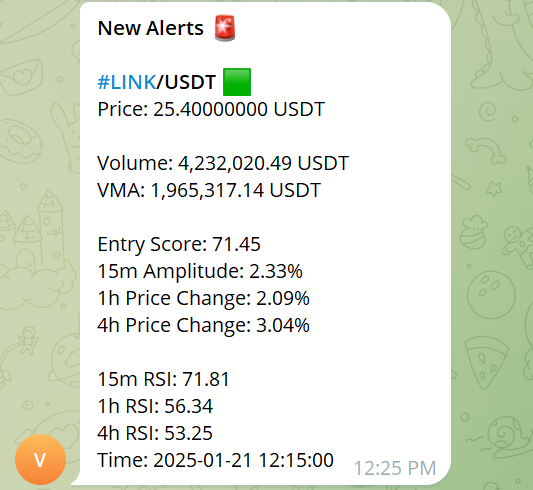

# Crypto Watcher

This project is a Laravel-based application designed to monitor cryptocurrency real-time data using WebSocket connections and custom scripts for initialization and command execution.

---

## Features

- Displays real-time cryptocurrency data in a structured table format.
- Provides key metrics such as RSI values (1m, 15m, 1h, 4h), price changes, trading volumes, and EMA trends.
- Alerts for RSI levels, crossovers, and volume changes via `RSIAlert`, `CrossoversAlert`, `VolumesAlert`, and other alert modules.
- Uses WebSocket streams for continuous and live updates.
- Includes `init.sh` for setup and `commands.sh` for running the application.

---

## Requirements

- **PHP**: 8.2
- **Laravel**: 11.9
- **Composer**
- **Ratchet WebSocket Library**
- **Shell**: Ensure your system supports Bash scripts (`init.sh` and `commands.sh`).

---

## Installation

**Clone the Repository**:

1. Clone the repository:

   ```bash
   git clone https://github.com/zeyad82/crypto-watcher.git
   cd crypto-watcher
   ```

2. **Install Dependencies**:

   ```bash
   composer install
   ```

3. **Run the Initialization Script**:
   Execute `init.sh` to set up the application:

   ```bash
   ./init.sh
   ```

   This script ensures all required configurations and dependencies are set up.

4. **Configure Laravel**:

   - Ensure Laravel is properly configured (update `.env` with your environment settings).

---

## Usage

### Adding Commands to Cronjob

To ensure continuous operation, add the following to your cronjob:

1. **Edit the Cron Configuration**:

   ```bash
   crontab -e
   ```

2. **Add Artisan Schedule Command**:
   Schedule the Laravel task scheduler to run every minute:

   ```bash
   * * * * * php /path-to-your-project/artisan schedule:run >> /dev/null 2>&1
   ```

3. **Add Custom Commands**:
   If you have custom scripts like `commands.sh`, add them as needed:

   ```bash
   */15 * * * * /path-to-your-project/commands.sh >> /dev/null 2>&1
   ```

4. **Run the Application**:
   Use the `commands.sh` script to start the application:

   ```bash
   ./commands.sh
   ```

   This script runs the main monitoring process and logs output as specified.
---

## Code Structure

### Paths and Commands

#### `php artisan alerts:performance`
- **Path**: `app/Console/Commands/AlertsPerformance.php`
- **Description**: Evaluates the performance of alert modules such as `RSIAlert`, `CrossoversAlert`, and `VolumesAlert`. Logs results for analysis and debugging.

#### `php artisan alerts:update-results`
- **Path**: `app/Console/Commands/UpdateAlertResult.php`
- **Description**: Updates the database or cache with the latest alert results, ensuring real-time accuracy in displayed data.

#### `php artisan tracker:rsi-alert`
- **Path**: `app/Console/Commands/Tracker/RSIAlert.php`
- **Description**: Monitors RSI values and triggers alerts when specific thresholds (e.g., overbought/oversold) are crossed.

#### `php artisan tracker:crossovers-alert`
- **Path**: `app/Console/Commands/Tracker/CrossoversAlert.php`
- **Description**: Detects moving average crossovers, such as golden cross and death cross, and alerts on significant trends.

#### `php artisan tracker:volumes-alert`
- **Path**: `app/Console/Commands/Tracker/VolumesAlert.php`
- **Description**: Tracks changes in trading volumes and sends alerts when unusual spikes are detected.

#### `Livewire Cryptos Class`
- **Path**: `App/Livewire/Cryptos`
- **Description**: Manages the real-time update of the front-end table, reflecting current cryptocurrency data. Interacts with WebSocket streams and Laravel back-end logic.

#### `init.sh`
- **Path**: `/init.sh`
- **Description**: Prepares the environment by verifying configurations and installing necessary dependencies. Ensures the application is ready for deployment.

#### `commands.sh`
- **Path**: `/commands.sh`
- **Description**: Starts the application’s main processes and schedules continuous monitoring of cryptocurrency data.

---

## Example Output

### Main Dashboard


The main page of the application displays the following information for each cryptocurrency pair:

- **Symbol**: The trading pair (e.g., BTC/USDT, ETH/USDT).
- **Price**: The current price of the cryptocurrency.
- **RSI Metrics**: Relative Strength Index values for different timeframes (1m, 15m, 1h, 4h).
- **Price Changes**: Percentage changes in price over various timeframes (1m, 5m, 1h).
- **Volume Data**: Real-time trading volume data (1m, 5m, 1h, 24h).
- **EMA Trends**: Exponential Moving Average trends for 15m and 1h timeframes (e.g., bullish, bearish).
- **Up/Down %**: Percentage of price increases or decreases over the specified period.
- **Entry Score**: A calculated metric to suggest potential entry points for trades.

The application provides real-time alerts via Telegram with detailed cryptocurrency insights. Below are examples of alerts:

### Example 1: Volume and RSI Alert


### Example 2: EMA and RSI Alert


### Example 3: MACD and Trend Alert


---
## Troubleshooting

- **Initialization Issues**:
  Ensure `init.sh` completes successfully before running the application.

- **Connection Errors**:
  Verify internet connectivity and access to the WebSocket endpoint.

- **Missing Dependencies**:
  Run `composer install` or re-execute `init.sh` to ensure all dependencies are installed.

---

## License

This project is open-source and available under the MIT License.

---

## Contributions

Feel free to submit pull requests or create issues to improve this project!

